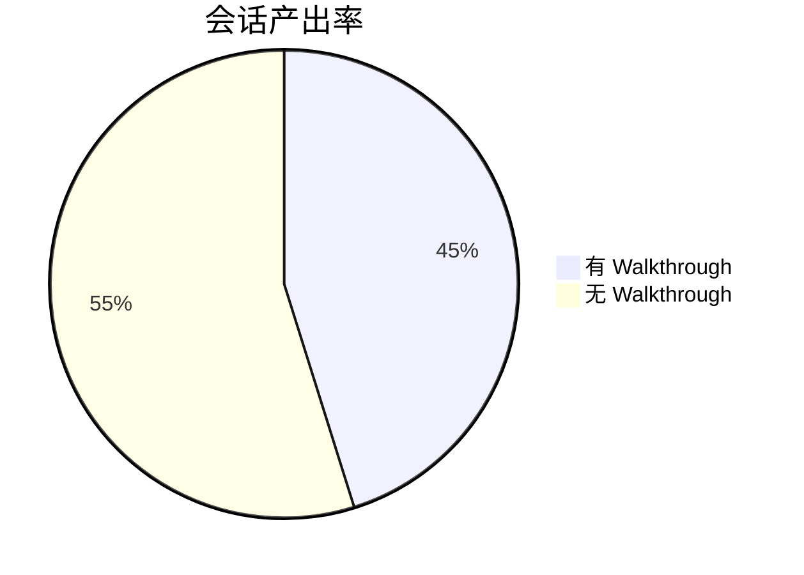

# 📊 Antigravity 度量报告 — 2026-04-04

> 自动生成 by `metrics-report` Skill | 采集时间: 2026-04-04T13:10:23Z

---

## Executive Summary

| 指标 | 数值 | 趋势 | 健康 |
|---|---|---|---|
| 📝 总会话数 | 62 | 基线 | 🟢 |
| 📄 Walkthrough 率 | 45% | 基线 | 🟡 (建议提高) |
| 🧩 Skills | 13 | 基线 | 🟢 |
| 📋 Workflows | 2 | 基线 | 🟢 |
| 📚 Knowledge 条目 | 13 | 基线 | 🟢 |
| 💓 心跳巡逻次数 | 1 | 基线 | 🟢 |
| 📚 记忆晋升 | 2 条 | 基线 | 🟢 |
| 📏 GEMINI.md 行数 | 81 | 基线 | 🟢 |
| 🗑️ 临时文件 | 10 (1.5M) | — | 🟢 |

---

## 详细指标

### 会话统计

- 总会话数: **62**
- 有 Walkthrough 产出: **28**
- 产出率: **45%**

### 能力资产

| 资产类型 | 当前数量 | 增量 |
|---|---|---|
| Skills | 13 | 0 (首次) |
| Workflows | 2 | 0 (首次) |
| Knowledge | 13 | +2 (相较于上个阶段) |

### 心跳健康

- 总巡逻次数: **1**
- 最近状态: **warn**
- 累计发现问题: **3**

### 记忆晋升

- 已晋升条目: **2**
- 已合并条目: **0**
- 已扫描会话: **28**

---

## 异常告警

> [!WARNING]
> Walkthrough 率为 45%，低于建议的 50% 健康线。建议在完成工作后养成要求 Agent 生成 Walkthrough 的习惯，以便为记忆晋升引擎提供更多素材。

---

## 建议行动

1. **清理临时文件**：目前有 10 个临时文件，建议定期清理 `.agents/tmp/`。
2. **处理心跳告警**：根据首次心跳报告，解决过期临时文件和 timestamps 的更新问题。
3. **增加高产出会话**：鼓励在未来的会话中最后一步执行“全做”或要求写 Walkthrough。

---

## 与上期对比 (基线建立)

由于这是首次执行度量报告，当前数据作为未来的对比基线。

---

> **下次采集**：下次心跳巡逻时自动执行 | **完整数据**：`.agents/tmp/metrics_latest.json`
