# 🚀 Antigravity 团队一键接入指南 (Onboarding Guide)

欢迎加入 **Antigravity** 架构体系！
这本图文并茂的简明手册，将指导你如何在 **3 分钟内**，全自动地为你的电脑与 IDE 环境装配顶级架构师级别的 AI 协作设定。

---

## 🎯 我们的目标架构

在运行完一键脚本后，这套环境会自动为你装填以下“四大超能力”：

1. **全局人格锁死 (`GEMINI.md`)**：让大模型从“碎嘴闲聊的客服”变成“冷酷无情的高干工程师”。
2. **专属沙盒隔离 (`.agents/tmp`)**：测试文件有了指定收容所，斩断系统脏数据，完美绕过苹果 Mac 的桌面防爬拦截。
3. **记忆体与外接神经 (`Knowledge & MCP`)**：自动挂载团队此前沉淀的最佳实践大图，无缝唤醒外接组件。
4. **自检哨兵 (`Heartbeat`)**：每次新开工，系统自己先跑一遍防呆体检，侦测落灰的文件和丢失的规范。

```mermaid
graph TD
    User["👱 新成员克隆代码并进场"] --> |右侧对话框发出指令| CMD["💻 输入: /onboard"]
    CMD --> Agent{"🤖 Antigravity Agent 执行引擎"}
    Agent --> |Step 1| ENV["🔍 探测本机纯净度与缺陷"]
    Agent --> |Step 2| SYS["📄 自动注入团队版 GEMINI.md 规则"]
    Agent --> |Step 3| DIR["📂 补齐安全沙盒与知识流物理目录"]
    Agent --> |Step 4| MCP["🔌 激活挂载外部工具 (如 pdf-reader)"]
    Agent --> |Step 5| HRT["💓 执行全站防呆倒计时心跳测试"]
    HRT --> SUCCESS["🎉 满屏飞绿验证通过，Ready to Code!"]
```



---

## 🛠️ 纯傻瓜式操作步骤：请按步照做

### 🔹 准备条件
> [!IMPORTANT]
> 1. 请确保你已经下载安装了 **Google Antigravity IDE**。
> 2. **克隆项目主线代码**：在终端执行以下命令，将远程仓库（此代码库）拉取到你的电脑本地。请将占位符替换为实际的 Git 地址：
>    ```bash
>    git clone https://github.com/Albertsun6/AntigravityOnboard.git
>    cd AntigravityOnboard
>    ```
> 3. 在 Google Antigravity IDE 中，点击 `Open Folder`，选择刚刚克隆的 `AntigravityOnboard` 文件夹将其打开。

### 🔹 Step 1. 唤醒系统
在 IDE 右侧的对话窗内，无需寒暄，无需铺垫，直接原封不动地向大模型输入这句魔法字符：

```text
请帮我执行团队的 /onboard 流程
```

### 🔹 Step 2. 欣赏自动装配表演 (Agent 接管)
此时你可以双手松开鼠标。系统会立刻在终端区接管命令行并在本地新建文件夹配置底盘。
中途控制台会闪现底层探测画面，无需紧张：

```bash
=== Antigravity Onboarding Probe ===
1. Global GEMINI.md:   ❌ 不存在
2. Project GEMINI.md:  ⚠️ 不存在（可选）
3. Skills 目录:     ✅ 已发现团队的 13 个神级基建
```

> [!TIP]
> 第一行报红是不存在 `GEMINI.md`？别慌，下一秒它就会自动切出内核 `cp` 命令，将项目里的团队最强模板提取二分法注射到你的 Mac 根目录锁定。

### 🔹 Step 3. 收割全站体检表
等代码流闪避结束，Agent 必然会在聊天窗口向你甩出一张如下形式的最终体检单：

| # | 检查项 | 结果 | 备注 |
|---|---|---|---|
| 1 | 全局 GEMINI.md | ✅ | 核心约束接驳完成 |
| ...| ... | ... | ... |
| 10 | Knowledge 阵地 | ✅ | 团队领域智囊上膛 |

**恭喜！当出现 `✅ 通过` 时，你已经是一名火力全开的 Antigravity 驾驶员。**

---

## ⚔️ 附身符：生存与战斗词汇表

既然装备已配齐，请不要再用跟 Siri 聊天的语气对环境发令。牢记以下四个**最常用暗号**去指挥 Agent 替你打仗干活：

| 暗号指纹 | 战地场景说明 | 核心效果 |
|---|---|---|
| **`直接做`** | “就补一行前端 CSS，别给我整计划表了，嫌烦！” | 屏蔽冗长的架构规划系统（Planning Mode），**当场爆代码执行**。 |
| **`验收`** | “代码重构完了没跑过，不知页面有没有裂开...” | 唤醒强制自测雷达，自动完成「功能对齐/UI 畸形/0报错/深水边界」的 5 维度排雷网兜底。 |
| **`开新局`** | 这次对话聊了一百轮，发现它开始变装傻甚至胡言乱语忘事时。 | 一键清理它当前重度过载的脑神经，抛出一手极精简的**进度交接卡**，供你带向下一个新对话中满血复活。|
| **`记住 <内容>`** | “卧槽你刚刚这一套组件排查思路太神了，以后就这么干！” | 把这部分临时对话直接提升淬炼为 **Knowledge 长期记忆**，以后系统就算断电重启，也绝对按这个定式防坑。 |

> [!WARNING]
> 大模型是资源，不要跟你的 Agent 谈心浪费 Token 字数，把“请、谢谢、如果可以的话”统统删掉。**直接陈述底层逻辑和约束边界！**

拔剑吧。
