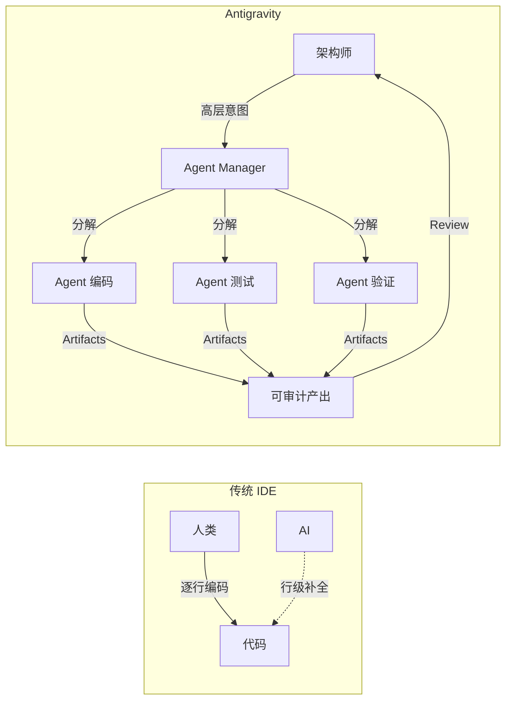
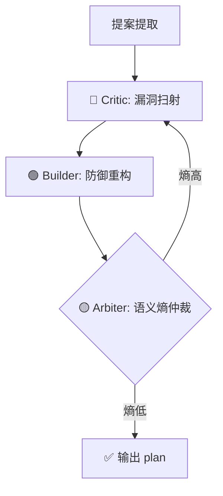
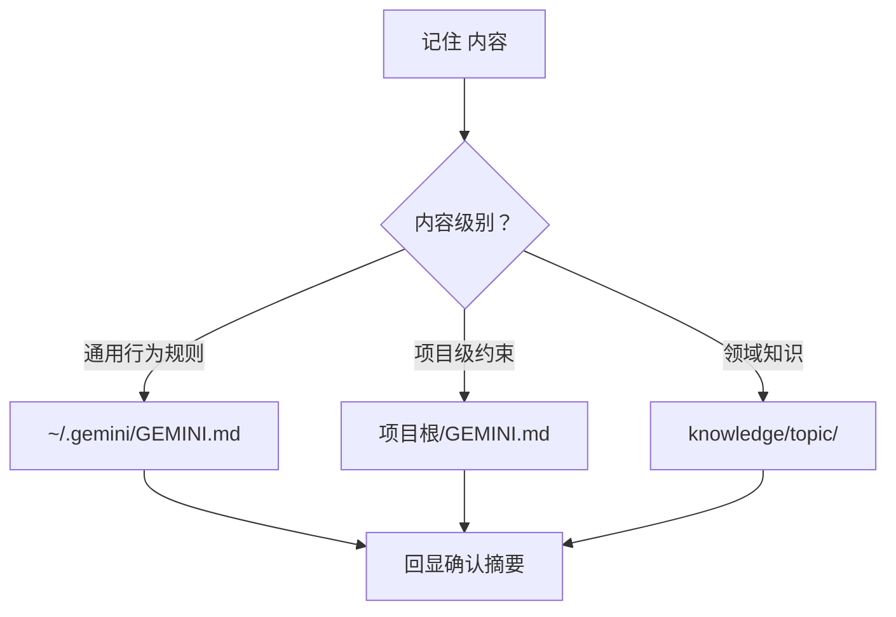
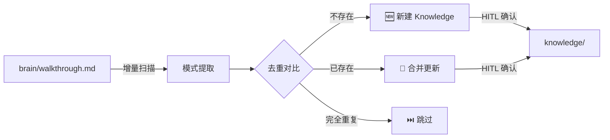
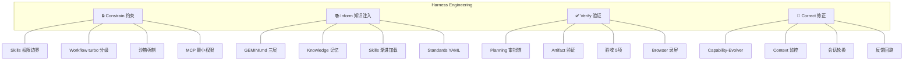

# Antigravity 最佳实践手册

> **定位**：Google Antigravity IDE 的殿堂级实战操作手册。覆盖 Skills / Workflows / Agents / Knowledge / MCP / Harness 治理全域。
> **适用版本**：Antigravity 2026 Q1+ ｜ **维护者**：峰哥团队

---

## 目录

| # | 模块 | 一句话 |
|---|---|---|
| M1 | [全景架构认知](#m1-全景架构认知) | Agent-First 是范式革命 |
| M2 | [四层目录结构](#m2-四层目录结构全景图) | 治理基建的物理骨架 |
| M3 | [GEMINI.md 圣经](#m3-geminimd-配置圣经) | 200 行黄金法则 |
| M4 | [Skills 设计大全](#m4-skills-设计模式大全) | 从骨架到分类矩阵 |
| M5 | [Workflows 规范](#m5-workflows-设计规范) | Slash 命令与 Turbo 编排 |
| M6 | [Planning Mode 三件套](#m6-planning-mode-三件套) | Plan → Task → Walkthrough |
| M7 | [MCP Server 配置](#m7-mcp-server-配置与管理) | Tool Contract 最小权限 |
| M8 | [Knowledge 知识库](#m8-knowledge-知识库管理) | 长期记忆工程 |
| M9 | [终端安全约束](#m9-终端命令与安全约束) | Blast-Radius 控制 |
| M10 | [Harness 治理体系](#m10-harness-治理体系) | Model is Commodity, Harness is Moat |
| M11 | [反模式警示录](#m11-反模式警示录) | 8 大深坑全解 |

---

## M1. 全景架构认知

### 1.1 Agent-First ≠ Copilot 升级版

传统 IDE（VSCode + Copilot）：**"人类写代码，AI 补全"**。
Antigravity：**"人类做架构师，AI Agent 做工程师"**。



### 1.2 三大操作面

| 操作面 | 定位 | 使用场景 |
|---|---|---|
| **Editor View** | 代码编辑器 | 精细微调、审阅 |
| **Agent Manager** | 任务控制中心 | 任务下发、并行编排、进度监控 |
| **Browser** | 集成浏览器 | E2E 测试录屏、Preview、信息采集 |

**Agent Manager 是主战场，Editor 是质检台，Browser 是验证现场。**

### 1.3 自主权分级

| 场景 | Level | 理由 |
|---|---|---|
| 架构级重构 | 🔒 Manual | 影响面大，逐步确认 |
| 功能迭代 | ⚡ Semi-Auto | 读写自动，删除/部署需审批 |
| 已验证固定流程 | 🚀 Turbo | 构建/格式化等确定性操作 |

### 1.4 Scaffolding vs Harness

| 概念 | 定义 | Antigravity 体现 |
|---|---|---|
| **Scaffolding** | 启动前静态准备 | `GEMINI.md`、SKILL.md frontmatter、`mcp_config.json` |
| **Harness** | 运行时动态管控 | Planning Mode 审批链、turbo 控制、沙箱隔离 |

> Scaffolding 定义 Agent **能做什么**，Harness 控制 Agent **实际做什么**。

---

## M2. 四层目录结构全景图

### 2.1 全景树

```
📂 项目根/
├── 📄 GEMINI.md                    ← L1: 项目级 System Prompt
├── 📂 .antigravity/                ← L0: IDE 自动生成（勿手动改）
│   └── conventions.md
├── 📂 .agents/                     ← L2: Agent 能力层（核心）
│   ├── 📂 skills/                  ← 技能库
│   │   ├── 📂 Capability-Evolver/  (🧠 元认知)
│   │   ├── 📂 browser-use/         (🌐 浏览器)
│   │   ├── 📂 Tavily-Agent-Search/ (🔍 检索)
│   │   └── 📂 _TEMPLATE/          ← ⭐ Skill 脚手架
│   ├── 📂 workflows/
│   │   ├── debate_architecture.md
│   │   └── _TEMPLATE_WORKFLOW.md   ← ⭐ Workflow 模板
│   ├── 📂 tmp/                     ← 沙箱安全临时目录
│   └── 📂 docs/                    ← 持久化报告
└── 📂 assets/

📂 ~/.gemini/                        ← L3: 全局用户配置
├── 📄 GEMINI.md                     ← 全局 System Prompt
└── 📂 antigravity/                  ← L4: App Data
    ├── 📂 brain/<conv-id>/          ← Artifacts (plan/task/walkthrough)
    ├── 📂 knowledge/               ← 知识库
    ├── 📂 scripts/                 ← 脚本
    ├── 📂 standards/               ← 工程标准
    ├── 📄 mcp_config.json          ← MCP 配置
    └── 📂 browser_recordings/      ← 录屏存档
```

### 2.2 四层职责边界

| 层级 | 路径 | 作用 | 颜色 |
|---|---|---|---|
| L0 | `.antigravity/` | IDE 自动生成，只读 | 🔘 灰 |
| L1 | 项目根 `GEMINI.md` | 项目级约束 | 🔵 蓝 |
| L2 | `.agents/` | Skills + Workflows + tmp | 🔴 红（核心） |
| L3 | `~/.gemini/GEMINI.md` | 全局人格 | 🟣 紫 |
| L4 | `~/.gemini/antigravity/` | 持久化状态 | 🟢 绿 |

**加载链**：L3 全局 → 合并 L1 项目 → 扫描 L2 Skills（仅 frontmatter）→ 按需激活。

> [!TIP]
> 子目录级 `GEMINI.md` 适合 Monorepo 场景，为不同模块设置差异化约束。

---

## M3. GEMINI.md 配置圣经

`GEMINI.md` 是 Agent 的 System Prompt，是人机 **行为契约**。Harness **Inform** 支柱的核心引擎。

### 3.1 三层层级

| 层 | 路径 | 适合放 |
|---|---|---|
| 🌐 全局 | `~/.gemini/GEMINI.md` | 人格、语言、行为模式、Response 格式 |
| 📁 项目 | 项目根/`GEMINI.md` | 技术栈、代码规范、测试要求、文件禁区 |
| 📂 子目录 | 子目录/`GEMINI.md` | 模块级特化 |

### 3.2 黄金法则：200 行上限

> GEMINI.md 行数与 Agent 性能成反比。超 200 行，注意力加速稀释。

| ✅ 该放 | ❌ 不该放 |
|---|---|
| 无法从代码推断的约束 | 模型已知通用知识 |
| Agent 行为模式 | 可搜索发现的信息 |
| 安全红线 | 大段技术文档（→ Knowledge） |
| 专有术语映射 | 一次性临时指令 |

### 3.3 全局 GEMINI.md 结构模板

```markdown
# Agent 人格（5-10 行）
## Core Behaviors（15-25 行）
1. 执行优先链  2. 确认协议  3. 澄清协议  4. 环境嗅探  5. 命令原子性
## Response Tiers（5-10 行）
## User Commands（10-15 行）
## Context Management（5-10 行）
## Domain Rules（20-30 行）
```

### 3.4 项目级 GEMINI.md 结构模板

```markdown
# 项目名称
## Tech Stack（框架 + DB + ORM）
## Coding Conventions（缩进 + 命名 + 类型）
## Architecture Constraints（路由前缀 + 禁止项）
## Testing Requirements（覆盖率 + 禁改测试）
## File Restrictions（🚫 NEVER modify: xxx）
```

### 3.5 信噪比优化

| 技巧 | 示例 |
|---|---|
| 动词前置 | ❌ "请尽量不要…" → ✅ "NEVER do…" |
| 结构化列表 | 列表 vs 段落节省 40% Token |
| 正面约束优先 | ❌ "不要用 var" → ✅ "使用 const/let" |
| 分层卸载 | 细节从 GEMINI.md → Skills |

---

## M4. Skills 设计模式大全

Skills 是 **能力扩展原语**，同时承担 Harness **Inform + Constrain** 双角色。

### 4.1 SKILL.md 标准骨架

```markdown
---
name: skill-name
description: 精准独特的功能描述（Agent 自动匹配的唯一触发依据）
---
# Instructions
## 核心触发点
## 前置检查（如有）
## 标准行动模式
1. 步骤一  2. 步骤二  3. 步骤三
## 约束边界（Harness: Constrain）
## 输出规范
```

### 4.2 三级渐进加载

| 级别 | 时机 | 加载内容 | Token 预算 |
|---|---|---|---|
| 🔍 Discovery | 启动时 | name + description | ~50 |
| ⚡ Activation | 匹配触发 | 完整 SKILL.md | ~500 |
| 🚀 Execution | 执行需要 | scripts/assets 按需 | 按需 |

**启示**：`description` 是唯一的自动匹配入口——必须精准独特无歧义。

### 4.3 Skills 分类矩阵

| 类别 | 代表 | Harness 角色 |
|---|---|---|
| 🧠 元认知 | `Capability-Evolver` | Correct（自修复） |
| 🔍 检索 | `Tavily-Agent-Search`, `find_skills` | Inform |
| 🌐 浏览器 | `browser-use` | Verify |
| 🔌 基建 | `awesome-mcp-servers`, `GOG-workspace-cli` | Constrain + Inform |
| 🤝 跨 Agent | `claude-code-integration` | Inform（上下文握手） |
| ✅ 验证 | `verify_static_helix_build` | Verify（质检门禁） |

### 4.4 复杂 Skill 目录

```
.agents/skills/complex-skill/
├── SKILL.md          ← 必须
├── scripts/          ← 辅助脚本
├── references/       ← 参考文档（按需加载）
├── assets/           ← 模板配置
└── examples/         ← 用法示例
```

### 4.5 设计黄金法则

1. **单一职责**：description 需要"和"连接 → 该拆
2. **触发精准**：包含独特领域关键词
3. **边界显式**：声明允许/禁止
4. **幂等安全**：重复执行无副作用
5. **可演进**：失败 3 次 → Capability-Evolver 触发

---

## M5. Workflows 设计规范

Workflows 是多步骤编排，Harness **Runtime Policy** 的载体。

### 5.1 标准结构

```markdown
---
description: 一句话描述（显示在 /slash-command 列表）
---
# 工作流名称
## Step 1: 步骤一
// turbo
## Step 2: 这步自动执行
## Step 3: 这步需审批
```

### 5.2 触发方式

| 方式 | 语法 |
|---|---|
| Slash Command | `/debate_architecture` |
| 自然语言 | Agent 匹配 description |
| 直接引用 | "按照 XX workflow 执行" |

### 5.3 Turbo 注解

| 注解 | 效果 |
|---|---|
| `// turbo` | 仅该步骤自动 |
| `// turbo-all` | 全部步骤自动 |
| 无注解 | 默认审批级别 |

### 5.4 MADE 多 Agent 辩论模式



### 5.5 Skill vs Workflow 决策

- 能 **一段话** 说清 → **Skill**
- 需要 **多角色** 或 **循环/分支** → **Workflow**

---

## M6. Planning Mode 三件套

Harness **Verify** 支柱的核心实现。

### 6.1 生命周期

```
📋 implementation_plan.md (设计) → 用户审批 ✅ → 📝 task.md (执行) → 📊 walkthrough.md (复盘)
```

### 6.2 各 Artifact 规范

**implementation_plan.md**：背景 + User Review Required（`> [!IMPORTANT]`） + Proposed Changes（[NEW]/[MODIFY]/[DELETE]）+ Open Questions + Verification Plan

**task.md**：`[ ]` 未完成 / `[/]` 进行中 / `[x]` 已完成

**walkthrough.md**：变更总结，支持嵌入截图（``）、录屏、Mermaid、Diff

### 6.3 Planning vs Fast Mode

| 场景 | 模式 |
|---|---|
| 架构级重构、新功能 | ✅ Planning |
| Bug 修复 < 3 文件 | ⚡ Fast ("直接做") |
| 格式化/注释 | ⚡ Fast |

### 6.4 嵌入规范

1. **绝对路径**：``
2. **归属检查**：非 brain 目录的文件先复制过去再嵌入
3. **文件链接**：`[utils.py](file:///path)`，不要用反引号包裹链接文本

---

## M7. MCP Server 配置与管理

MCP (Model Context Protocol) 连接外部工具的标准协议。Harness **Tool Contract** 的物理实现。

### 7.1 配置

路径：`~/.gemini/antigravity/mcp_config.json`

```json
{
  "mcpServers": {
    "server-name": {
      "command": "npx",
      "args": ["-y", "@scope/mcp-server-name"],
      "env": { "API_KEY": "环境变量引用" }
    }
  }
}
```

### 7.2 当前已配置

| Server | 能力 |
|---|---|
| `pdf-reader` | `read_pdf` / `search_pdf` / `get_pdf_metadata` |

### 7.3 推荐扩展

| 分类 | Server | 核心能力 |
|---|---|---|
| 🗄️ 数据库 | `mcp-server-postgres` | PostgreSQL 直连 |
| 📦 版本控制 | `mcp-server-github` | Issues / PR / 仓库 |
| 📂 文件 | `mcp-server-filesystem` | 增强文件管理 |
| 🔍 搜索 | `mcp-server-brave-search` | Brave 搜索 API |
| 💬 通信 | `mcp-server-slack` | Slack 消息管理 |

### 7.4 安全最小权限 (Harness: Constrain)

> [!CAUTION]
> 每添加一个 MCP Server，Attack Surface 扩大一级。

1. **只装需要的**：不预装"以后可能用"的
2. **环境变量隔离**：API Key 走 `env` 字段，绝不硬编码
3. **读写分离审批**：读操作 auto-run，写操作必须 HITL
4. **沙箱 DB 原则**：永远指向 dev/staging，绝不直连 production

---

## M8. Knowledge 知识库管理

Knowledge 是 **长期记忆中枢**。Harness Inform 支柱的持久化外存层。

### 8.1 存储结构

```
~/.gemini/antigravity/knowledge/
├── ai_context_management/
│   ├── metadata.json       ← 元信息
│   ├── timestamps.json     ← 时间
│   └── artifacts/          ← 产出
├── odoo_18_form_ui_layout/
├── prompt_compiler_unified_pattern/
└── knowledge.lock
```

### 8.2 三者职责边界

| 维度 | GEMINI.md | Skills | Knowledge |
|---|---|---|---|
| 本质 | 行为契约 | 能力指令 | 知识存储 |
| 加载 | 每次启动 | 按需激活 | 被引用时 |
| 内容 | 规则/约束 | 触发+操作 | 事实/模式/经验 |
| 大小 | < 200 行 | < 500 tokens | 不限 |
| 写入 | 手动编辑 | 手动/Evolver | `记住` 命令 |

### 8.3 `记住` 路由逻辑



### 8.4 创建规范

1. **目录命名**：`snake_case`
2. **必备**：`metadata.json`（title, description, created_at）
3. **内容**：Markdown 写入 `artifacts/`
4. **交叉引用**：metadata 标注 `related_topics`

### 8.5 记忆晋升机制（Memory Promotion）

心跳巡逻会基于**数据增量**自动扫描新增会话的 `walkthrough.md`，提取可复用模式并晋升为 Knowledge 条目：



| 来源 | 晋升条件 | 目标 | 审批 |
|---|---|---|---|
| walkthrough 经验总结 | 出现 ≥ 2 次相同模式 | `knowledge/` 新条目 | ⚠️ HITL |
| 已有 Knowledge 条目 | 新信息补充 | `knowledge/` 合并更新 | ⚠️ HITL |

**增量原则**：基于 `PROMOTE_STATE.json` 中的 `sessions_scanned` 列表判定数据增量，只处理未扫描的新增会话——不以时间窗口为依据。

晋升过程通过 `memory-promote` Skill 执行，所有写操作需 HITL 确认。

---

## M9. 终端命令与安全约束

终端是 Agent 最大的 Attack Surface。Harness **Blast-Radius Containment** 前线。

### 9.1 命令原子性 (Anti-Hang)

> [!CAUTION]
> 绝对禁止在 `echo "..."` 内嵌套 `$()` 子壳。会导致进程挂死。

```bash
# ❌ 禁止
echo "$(uv run python3 -c 'print(1)')"

# ✅ 原子化
python3 -c 'print(1)' && echo "完成"
```

| 规则 | 描述 |
|---|---|
| 单一职责 | 一条命令一件事 |
| `&&` > `$()` | 链式 > 嵌套 |
| `.venv/bin/python` > `uv run` | 直接路径避开启动开销 |

### 9.2 环境嗅探 (Environment Sniffing)

拉取依赖前**必须先探测**：

| 场景 | 探针命令 |
|---|---|
| Docker | `docker images \| grep <name>` |
| Node | `ls -la node_modules/.package-lock.json 2>/dev/null` |
| Python | `ls -la .venv/bin/python 2>/dev/null` |
| Brew | `brew list \| grep <name>` |

### 9.3 沙箱隔离

> [!WARNING]
> 所有临时文件 → `.agents/tmp/`。**严禁** macOS 全局 `/tmp/` 或 `~/`。

```bash
# ❌ 禁止
/tmp/scratch.py

# ✅ 正确
.agents/tmp/scratch.py
```

---

## M10. Harness 治理体系

> **核心命题**：**Model is Commodity, Harness is Moat**。模型普遍可得，差异化在于如何约束、赋能、验证和修正它。

### 10.1 四大支柱总览



### 10.2 Constrain — 定义边界

约束逐层收紧：

| 层级 | 机制 | 示例 |
|---|---|---|
| 全局 | `~/.gemini/GEMINI.md` | "禁止删除文件" |
| 项目 | 项目 `GEMINI.md` | "禁改 migration" |
| Skill | SKILL.md 边界 | "仅读取，禁写入" |
| Workflow | `// turbo` | 哪些步骤可全自动 |
| 工具 | MCP env | API Key Scope |
| 运行时 | Confirmation Protocol | 人工门禁 |

### 10.3 Inform — 知识注入

信息金字塔（从通用到专精）：

```
模型训练知识 → 全局 GEMINI.md → 项目 GEMINI.md → Knowledge → Skills → MCP 实时数据
```

**原则**：上层放规则，下层放操作，外圈放知识。

### 10.4 Verify — 验证信任

| 机制 | 时机 | 信任级别 |
|---|---|---|
| Planning 审批 | 架构变更前 | 🔴 最高（阻塞） |
| Task 跟踪 | 执行中 | 🟡 实时可视 |
| `验收` 5 项 | 用户触发 | 🔴 最高 |
| Browser 录屏 | E2E 测试时 | 🟢 辅助 |
| Walkthrough | 完成后 | 🟢 沉淀 |

**`验收` 五项清单**：Func（功能）/ UI（界面）/ Resp（性能）/ NoErr（零报错）/ Edge（边界）

### 10.5 Correct — 自修复

**Capability-Evolver 闭环**：

```
❌ 连续3次失败 → 🔍 外部求援 → 📖 吸收方案 → 📝 固化新Skill → 🔄 重试成功 ✅
```

**Context 健康度**：

| 状态 | 条件 | 行动 |
|---|---|---|
| 🟢 Healthy | < 15 turns | 继续 |
| 🟡 Warn | 15-25 | 开始持久化关键上下文 |
| 🔴 Critical | > 25 | 执行 `开新局` |

### 10.6 成熟度自评

| 支柱 | L0 裸奔 | L1 基础 | L2 标准 | L3 高级 |
|---|---|---|---|---|
| Constrain | 无约束 | GEMINI.md | +Skill边界 | +MCP权限+沙箱 |
| Inform | 只靠提示 | GEMINI.md | +Knowledge | +分层+MCP |
| Verify | 肉眼 | Planning | +验收 | +录屏+自动化 |
| Correct | 手动修 | 有反馈 | +Evolver | +Context监控 |

---

## M11. 反模式警示录

### ❌ 1. Context Bloat（上下文膨胀）
GEMINI.md 超 500 行 → 注意力被噪音稀释。
**修正**：操作 → Skills，知识 → Knowledge，GEMINI.md < 200 行约束。

### ❌ 2. 全局 /tmp/ 泄漏
临时文件写入 `/tmp/` → macOS 沙箱弹窗中断。
**修正**：铁律 `.agents/tmp/`。

### ❌ 3. 手动拷粘代替固化
每次重写提示词 → 知识无法积累。
**修正**：重复 3 次以上 → 固化为 Skill。

### ❌ 4. 无 Plan 直做架构变更
5+ 文件变更跳过 Planning → 返工概率飙升。
**修正**：> 3 文件 → 必须 Planning Mode。

### ❌ 5. 盲信 Agent 输出
Agent 说完成就信 → Bug 合入主干。
**修正**：关键变更后必须 `验收` 五项检查。

### ❌ 6. MCP 权限过宽
生产 API Key / 连生产 DB → Agent 误操作影响线上。
**修正**：MCP 连 dev/staging，DML 必须 HITL。

### ❌ 7. Skill Description 模糊
"处理各种任务" → 误触发/竞争激活。
**修正**：包含独特领域关键词和触发条件。

### ❌ 8. Context 窗口耗尽不换会话
30+ turns → 模型遗忘早期指令。
**修正**：Context 🔴 时执行 `开新局`。

---

## 附录 A: 快速参考卡

### 命令速查

| 命令 | 效果 |
|---|---|
| `直接做` | 跳过确认立即执行 |
| `深挖` | 纵向展开 5W2H |
| `拉远` | 缩到更高抽象层 |
| `总结` / `转向` / `全做` | 总结 / 转向 / 执行全部 |
| `验收` | 5 项检查清单 |
| `进化` | 建议规则优化 |
| `记住 <内容>` | 持久化 |
| `开新局` | 标准化换会话 |
| `朗读 <内容>` | TTS 语音 |

### 路径速查

| 文件 | 路径 |
|---|---|
| 全局 Prompt | `~/.gemini/GEMINI.md` |
| 项目 Prompt | 项目根/`GEMINI.md` |
| Skill | `.agents/skills/<name>/SKILL.md` |
| Workflow | `.agents/workflows/<name>.md` |
| 临时文件 | `.agents/tmp/` |
| MCP 配置 | `~/.gemini/antigravity/mcp_config.json` |
| Knowledge | `~/.gemini/antigravity/knowledge/<topic>/` |
| Standards | `~/.gemini/antigravity/standards/` |
| Artifacts | `~/.gemini/antigravity/brain/<conv-id>/` |

---

## 附录 B: Harness 快速自检表

- [ ] 全局 GEMINI.md < 200 行
- [ ] 项目 GEMINI.md 配置技术栈+约束
- [ ] `.agents/tmp/` 已创建且在 GEMINI.md 声明
- [ ] ≥ 3 个核心 Skills
- [ ] ≥ 1 个 Workflow
- [ ] MCP 仅配置必要 Server
- [ ] Planning Mode 默认启用
- [ ] `验收` 命令团队已知晓
- [ ] Context 健康度监控已配置
- [ ] Knowledge ≥ 1 条目

---

> **最后更新**：2026-04-04 ｜ **基于**：Antigravity 2026 Q1 + Harness Engineering 2026
