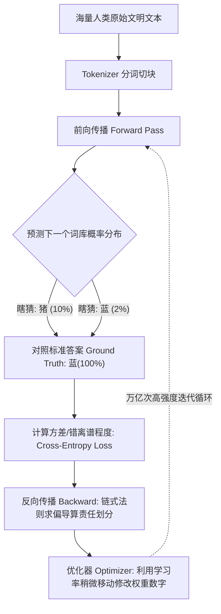
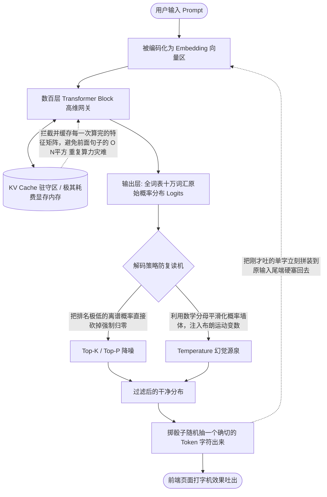
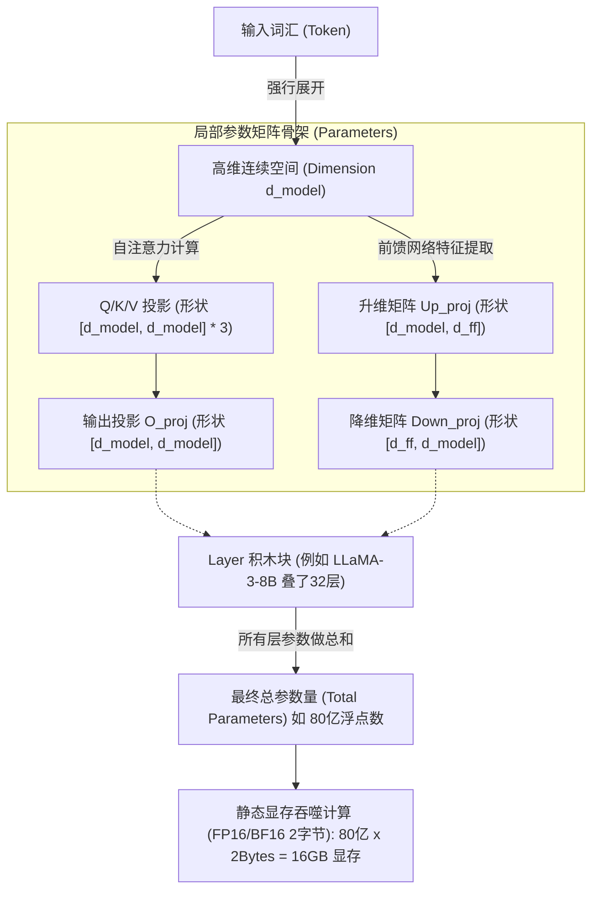

# LLM 底层运行机制与原理解析

> 本文档用于建立对大语言模型（LLM）底层运作方式的结构化物理认知，彻底穿透“黑盒API魔法”的初级视角。

## 第一部分：核心架构机制图解

大模型的生命周期主要分为两个截然不同的物理形态：**训练时（空间压缩的倒推求导）** 与 **推理时（时间流逝的掷骰概率）**。

### 1. 模型训练 (Training)：找极值的梯度游戏
训练阶段不需要理会任何上下文语境或者对话格式，它只做极其纯粹的无监督填空题。本质是用暴力计算力碾压概率曲面，通过微积分寻找收敛极点的**有损数据压缩过程**。

### 2. 模型使用 (Inference)：伴随遗忘的单向自回归
推理阶段也就是平时你与对话窗口互动发生的事。这是一个严酷的单行道循环，因为每吐出一个字，模型自身其实会立刻陷入“失忆”，必须靠重新读入刚才吐出的话来维持连贯。

---

## 第二部分：参数 (Parameters) 彻底祛魅

> **一句话反直觉总结**：参数就是你在跑本地大模型的时候，占满你整个显存或内存的那几百亿个乱糟糟的无逻辑**浮点数字矩阵 (浮点数组)**。

### 1. 物理形态与显存门槛
参数只讲究暴力的字节大小物理法则。
如果在工业界我们以 `FP16（半精度浮点，每个参数占 2 Bytes）`的格式保存并运行大模型：
- 一个 **7B模型（70亿参数）** 的静态存储重量就是 $70亿 \times 2 Bytes \approx 14 GB$。
- 这意味着，显卡 GPU 核心想做一轮乘法之前，必须强制将这 14GB 的数据**全部、一口气生吞**倒流进 VRAM 里。如果你的显存不够 14G，直接就会触发 OOM 爆炸瘫痪。这就是玩大模型必须高额硬件资本的根本命门。

### 2. 知识的高维存在形态（打碎的神殿）
很多从传统 CRUD (增删改查) 开发转战大模型的人，容易固执地以为模型是一个 MySQL。以为输入 Select 就能在一块写着 `[周杰伦]-[歌手]` 的特别参数块里读取资料。

**绝对不是。**

- 人类全书馆的知识在这里是被极致地**打散、切碎**，如同颜料掉入海水中般“溶解 (Distributed Representation)”进那几百亿个没有任何直观逻辑可解释的连续数字里。
- 你提问的过程，是在用你的问题组成的高维钥匙，去强行穿透并 **解压缩 (Decompress)** 一段恰好类似形状的数字。
- 这引发了当前 AI 的最终物理绝症：**幻觉 (Hallucination)** 永远无法100%避免。因为它本质上只拟合连续性的形状与分布，本身从结构上就不提供类似数据库的主键唯一约束。它不知真假，只凭直觉。
